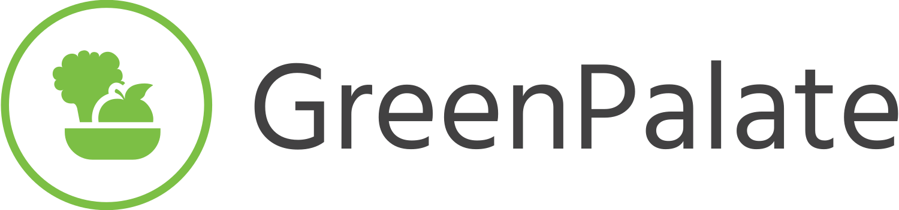
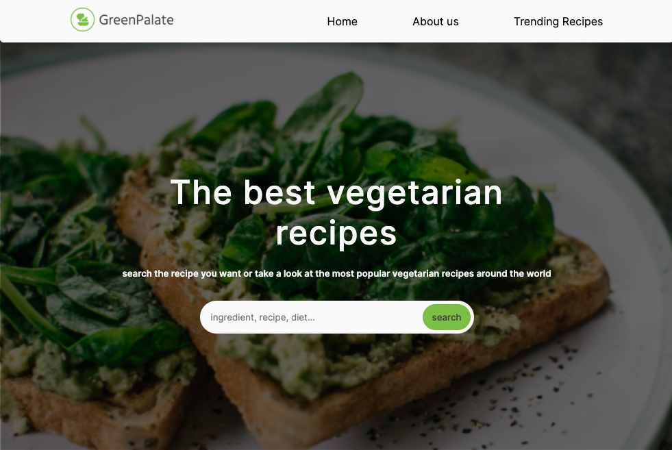

# <a href="https://grennpalate.netlify.app/"></img></a>

[![Netlify Status]](https://app.netlify.com/sites/greenpalate/deploys)

Welcome to GreenPalate, your ultimate destination for discovering and exploring a world of delightful vegetarian recipes.

<picture  align="center"  >

</img>

</picture>

## Overview

GreenPalate is a user-friendly web application designed to make your vegetarian culinary journey enjoyable and accessible. With a diverse selection of recipes, customizable search options, and a seamless interface, GreenPalate is your go-to platform for embracing a vibrant, plant-based lifestyle.

## Features

- **Effortless Exploration**: Intuitive search functionality for easy discovery of vegetarian recipes.

- **Diverse Options**: Explore recipes catering to various tastes, dietary preferences, and lifestyles.

- **Customization**: Tailor your search based on categories like popular, budget-friendly, quick, and healthy options.

- **Modern Design**: A visually appealing and user-friendly interface for a delightful browsing experience.

## Usage

Simply visit [GreenPalate](https://greenpalate.netlify.app) and start exploring the world of vegetarian recipes. Customize your search, find your favorites, and embark on a delicious journey.

## Built With

![html]

![css]

![Javascript]

![react]

![reactRouter]

![reactQuery]

![sass]

![vite]

## Developer

Giuseppe Vassallo - [Linkedin](https://linkedin.com/in/giuseppe-vassallo-a24885291)

try the app! [GreenPalate](https://grennpalate.netlify.app/)

Enjoy your culinary adventures with GreenPalate! 🌱🍽️

<!-- MARKDOWN LINKS & IMAGES -->

<!-- https://www.markdownguide.org/basic-syntax/#reference-style-links -->

[Javascript]: https://img.shields.io/badge/JavaScript-323330?style=for-the-badge&logo=javascript&logoColor=F7DF1E
[html]: https://img.shields.io/badge/HTML5-E34F26?style=for-the-badge&logo=html5&logoColor=white
[css]: https://img.shields.io/badge/CSS3-1572B6?style=for-the-badge&logo=css3&logoColor=white
[react]: https://img.shields.io/badge/React-%2361DAFB?style=for-the-badge&logo=React&logoColor=black
[reactRouter]: https://img.shields.io/badge/React%20Router-%23CA4245?style=for-the-badge&logo=React%20Router&logoColor=black
[reactQuery]: https://img.shields.io/badge/React%20query-%23FF4154?style=for-the-badge&logo=React%20Query&logoColor=black
[sass]: https://img.shields.io/badge/sass-%23CC6699?style=for-the-badge&logo=sass&logoColor=white
[vite]: https://img.shields.io/badge/vite-%23646CFF?style=for-the-badge&logo=vite&logoColor=white
[Netlify Status]: https://api.netlify.com/api/v1/badges/ac9bb33f-92c6-4a45-bca8-15b6d1437071/deploy-status
